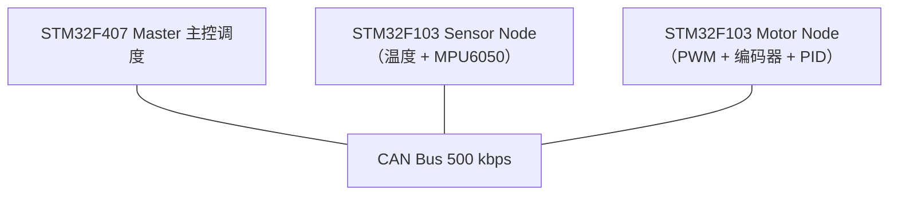

# STM32-CAN-Industrial-Control-System

基于 STM32 + FreeRTOS + CAN 总线的三节点工业控制系统原型，模拟工业现场"传感器采集 → 主控决策 → 执行器响应"的分布式控制链路。

系统以 STM32F407 为主控节点，两个 STM32F103 分别作为传感节点和执行节点，覆盖实时任务调度、CAN 总线通信、故障监测等工业嵌入式核心环节；电机 PID 速度闭环（Phase 4，代码就绪/实测延后）与 STM32 IAP 固件升级（学习与代码完成，待上电验证）。

---

## 1. 系统架构

完整任务与通信设计见 [docs/system-architecture.md](docs/system-architecture.md)。



```
                        CAN Bus (500 kbps)

            STM32F407 Master（主控调度）
                         │
            ┌────────────┴────────────┐
            │                         │
    STM32F103 Sensor Node    STM32F103 Motor Node
    （温度 + MPU6050，1s）    （PWM + 编码器 + PID）
```

**功能链路**：

```
传感器采集 → CAN 通信 → 主控决策 → CAN 指令 → 电机执行 → 编码器反馈 → PID 闭环
（PID 闭环实测延后，当前为代码就绪状态）
```

**节点职责**：

| 节点 | 硬件 | 职责 |
|---|---|---|
| Master | STM32F407ZGT6 | 任务调度、CAN 通信管理、数据处理、故障监控 |
| Sensor Node | STM32F103C8T6 | 温度数据上报 + MPU6050 六轴数据采集（CAN 上报） |
| Motor Node | STM32F103C8T6 | PWM 电机驱动、编码器测速、PID 速度闭环（代码就绪） |

---

## 2. 软件架构

```
Application Layer（应用逻辑）
        │
FreeRTOS Task Layer（任务调度）
        │
  HAL Driver Layer（外设驱动）
        │
   STM32 Hardware
```

**FreeRTOS 任务规划**：

```
FreeRTOS Scheduler
      │
      ├── CAN Receive Task    — 接收 CAN 报文，更新节点状态表
      ├── CAN Transmit Task   — 发送心跳帧与应用命令帧
      ├── Control Logic Task  — 温度越限检测 + 速度指令计算
      ├── Fault Monitor Task  — 心跳检测 + 离线告警
      └── UART Debug Task     — 状态输出
```

任务间通过 **Queue** 传递数据，中断通过 **Queue/EventGroup 的 FromISR 安全接口**通知任务（中断不处理业务），共享资源（如 UART）通过 **Mutex** 保护。

---

## 3. 技术栈

| 分类 | 内容 |
|---|---|
| MCU | STM32F407VET6、STM32F103C8T6 |
| RTOS | FreeRTOS（CMSIS_V1） |
| 通信 | CAN 总线（500 kbps），自定义应用层协议 |
| 控制 | PWM 输出、编码器反馈、PID 速度闭环（Phase 4 代码就绪） |
| 传感器 | 温度采集（模拟）；MPU6050 六轴姿态（已实现） |
| 工具 | STM32CubeMX、STM32CubeIDE、ST-Link V2、Git |

---

## 4. 开发进度

### Phase 1：STM32 基础工程能力 ✅ 已完成

- STM32CubeMX 工程创建与 HAL 库开发流程
- GPIO / UART / Timer / Interrupt 基础
- 三块板裸机点灯与串口通信验证

### Phase 2：FreeRTOS 实时系统 ✅ 已完成

- ✅ FreeRTOS 中间件集成与多任务调度
- ✅ 双任务/三任务验证（LED 翻转 + 串口状态输出）
- ✅ 任务通信（Queue，Producer-Consumer 模型）
- ✅ 同步与资源保护（Semaphore + Mutex）
- ✅ 软件定时器、中断安全 API、临界区保护
- ✅ 内存管理（heap_1 ~ heap_5 对比 + heap_4 合并实验）
- ✅ 任务优先级与优先级反转（信号量 vs 互斥锁对照实验）
- ✅ Event Group 事件组（AND/OR 多条件等待）+ 任务通知
- ✅ 异常检测调试（栈溢出/HardFault/configASSERT）+ 综合架构设计（Phase 2 收官）

### Phase 3：CAN 通信系统 ✅ 已完成

- ✅ F407 CAN1 500 kbps 收发（PCAN-View 双向验证）
- ✅ F103 节点 CAN 打通（修复 GPIO 复用配置，Node1/Node2 收发成功）
- ✅ 排障沉淀：双端 120Ω 终端电阻、先单机环回再组网、F1/F4 GPIO 差异
- ✅ 心跳协议文档化 + 故障注入测试（拔线/断电/主控离线，ACK 错误定位）
- ✅ 请求/应答命令帧闭环（0x101 请求上报、0x201 设置速度）
- ✅ 30 分钟压力测试（错误计数 0、无误报、无丢帧）

### Phase 4：电机控制闭环 🔄 进行中（代码就绪，闭环实测延后）

- ✅ PWM 电机驱动（L298N，含极性修复）
- ✅ 编码器反馈采集与标定（PPR=1079，0x202 上报 RPM）
- ✅ PID 速度闭环（增量式 + 积分分离/限幅，20ms 周期）
- ⏳ 闭环实测与调参（编码器 PWM 噪声问题延后处理）

### Phase 5：IAP Bootloader ✅ 学习与代码完成（待上电验证）

- ✅ Flash 分区管理与向量表偏移（Day29-30）
- ✅ Bootloader 跳转与升级模式（Day31-32）
- ✅ UART 升级协议 + Python 上位机（Day33）
- ✅ CRC32 完整性校验，损坏固件拒绝（Day34）

学习记录见 [docs/day29.md](docs/day29.md) ~ [docs/day34.md](docs/day34.md)；实施计划见 [docs/bootloader-plan.md](docs/bootloader-plan.md)（F407ZGTx + UART）。上电验证遵守"PID 闭环完成后"的烧录顺序约束。

### Phase 6：项目整理 ⏳ 规划中

- 代码重构与文档完善
- 系统联调与演示视频

---

## 5. 自定义 CAN 协议

三节点总线采用 11 位标准帧，固定 ID 分配（详见 [Day19 记录](docs/day19.md)）：

协议全文见 [docs/can-protocol.md](docs/can-protocol.md)。

| 帧 ID | 方向 | DLC | 内容 |
|---|---|---|---|
| 0x100 | F407 主控 → 总线 | 8 | 心跳帧：seq(2B 小端) + 0x55AA(2B) + 预留(4B)，1s |
| 0x101 | 主控 → Node1 | 1 | 命令帧：data[0]=0x01 请求上报温度 |
| 0x102 | Node1 → 主控 | 2 | 温度数据：temp(2B 小端)，1s |
| 0x103 | Node1 → 总线 | 6 | MPU6050 加速度计：ax/ay/az(各 2B 小端)，1s（主控暂未启用） |
| 0x201 | 主控 → Node2 | 3 | 命令帧：data[0]=0x01 设置速度，data[1..2]=目标速度(2B 小端) |
| 0x202 | Node2 → 主控 | 2 | 速度数据：RPM(2B 小端)，1s（Day25 起） |

---

## 6. 项目结构

```
STM32-CAN-Industrial-Control-System
├── firmware/
│   ├── master_node/        # F407 主控工程（FreeRTOS + HAL）
│   ├── sensor_node/        # F103 传感器节点工程
│   ├── motor_node/         # F103 电机节点工程
│   └── bootloader/         # F407 IAP Bootloader 工程
├── docs/                   # 学习记录与协议文档
├── hardware/               # 硬件接线说明
├── tools/                  # 上位机工具（UART 升级、冒烟测试）
├── 学习进度.md             # 每日学习进度跟踪
└── README.md
```

---

## 7. 学习记录

每日学习记录见 [docs/](docs/)，按 [Day 记录模板](docs/day_template.md) 编写：

- [Day 1：STM32 开发环境搭建](docs/day01.md)
- [Day 2：GPIO + UART 通信](docs/day02.md)
- [Day 3：UART 调试系统](docs/day03.md)
- [Day 4：Timer 定时器与中断](docs/day04.md)
- [Day 5：FreeRTOS 基础移植](docs/day05.md)
- [Day 6：FreeRTOS 任务管理与调度](docs/day06.md)
- [Day 7：FreeRTOS Queue 任务通信](docs/day07.md)
- [Day 8：FreeRTOS 同步机制（Semaphore & Mutex）](docs/day08.md)
- [Day 9：FreeRTOS 软件定时器与临界区保护](docs/day09.md)
- [Day 10：FreeRTOS 内存管理（heap_1 ~ heap_5）](docs/day10.md)
- [Day 11：FreeRTOS 任务设计与优先级管理](docs/day11.md)
- [Day 12：FreeRTOS 事件组与任务通知](docs/day12.md)
- [Day 13：FreeRTOS 异常检测与调试](docs/day13.md)
- [Day 14：FreeRTOS 综合架构设计（Phase 2 收官）](docs/day14.md)
- [Day 15：CAN 通信（F407 CAN1 500k + PCAN-View 验证）](docs/day15.md)
- [Day 16：F103 节点工程搭建](docs/day16.md)
- [Day 17：F103 CAN 排障与节点打通（PA11 输入模式修复）](docs/day17.md)
- [Day 18：三节点联调（协议映射 + 双 Bank 过滤 + 心跳离线检测）](docs/day18.md)
- [Day 19：心跳协议文档化 + 故障注入测试](docs/day19.md)
- [Day 20：CAN 理论收尾（帧格式/位同步/仲裁/过滤器）](docs/day20.md)
- [Day 21：请求/应答命令帧 + 压力测试（Phase 3 收官）](docs/day21.md)
- [Phase 3 复盘（Day 15-21）](docs/phase3-review.md)
- [CAN 代码与原理详解（面试速查）](docs/can-walkthrough.md)
- [Day 22：电机 PID 预热（理论 + 硬件接线）](docs/day22.md)
- [Day 23：Node2 TIM2 PWM + TIM3 编码器驱动](docs/day23.md)
- [Day 24：CAN 命令驱动电机 + 真实编码器上报](docs/day24.md)
- [Day 25：编码器标定 + RPM 换算](docs/day25.md)
- [Day 26：SerialPlot 波形 + 开环阶跃](docs/day26.md)
- [Day 27：PID 速度闭环](docs/day27.md)
- [Day 28：PID 调参与三节点联调](docs/day28.md)
- [Day 29：Bootloader 理论 + Flash 布局](docs/day29.md)
- [Day 30：APP 地址偏移 + VTOR](docs/day30.md)
- [Day 31：Bootloader 跳转 APP](docs/day31.md)
- [Day 32：升级模式设计](docs/day32.md)
- [Day 33：UART 固件传输](docs/day33.md)
- [Day 34：CRC32 完整性校验](docs/day34.md)

---

## 8. 学习资源与课程规划（江协科技）

项目配套的两套免费入门课程（B 站），按项目阶段对照使用：

| 课程 | BV 号 | 覆盖内容 | 对应阶段 |
|---|---|---|---|
| CAN 总线入门教程 | BV1vu4m1F7Gt | CAN 协议理论 + STM32 外设 + 多机通信 | Phase 3 |
| PID 入门教程 | BV1G9zdYQEr3 | PID 原理 + 编码器测速 + 闭环调试 + 双环 | Phase 4 |

### 8.1 CAN 课程对照（10P，约 6.7h）

| 分P | 内容 | 项目应用 | 优先级 |
|---|---|---|---|
| 1-1 | CAN 简介 & 硬件电路 | 接线规范：TXD→PA12、RXD→PA11、双端 120Ω 终端电阻、共地 | 已实操，扫读 |
| 1-2 | 帧格式 | 标准/扩展、数据/遥控/错误/过载帧 —— 面试理论 | 必看 |
| 1-3 | 位同步 | 采样点、波特率配置原理 | 重点看 |
| 1-4 | 仲裁 | ID 优先级设计（ID 越小优先级越高） | 必看 |
| 1-5 | 错误处理 | 错误主动/被动/总线关闭三状态、错误计数器 | 必看 |
| 2-1/2-2 | STM32 CAN 外设 | bxCAN 邮箱/FIFO/过滤器、初始化配置 | 可选（HAL 已用） |
| 3-1 | 环回测试 & 三设备互连 | 先环回后组网的调试方法 | 重点看 |
| 3-2 | 帧类型 & 标识符过滤器 | F407 精确过滤：掩码模式 vs 列表模式 | 重点看 |
| 3-3 | 中断接收 & 传输策略 | 中断+队列；定时/触发/请求三种发送策略 | 重点看 |

### 8.2 PID 课程对照（12P，约 8h）

| 分P | 内容 | 项目应用 | 优先级 |
|---|---|---|---|
| 1-1/1-2 | PID 基本原理 & 离散 PID | Day27 速度闭环实现 | 必看 |
| 1-3 | 驱动代码 & 编码电机 & SerialPlot | Day23-26 PWM/编码器/测速 | 必看 |
| 1-4 | PID 闭环实验 | Day28 调参（超调/震荡判断） | 必看 |
| 2-1 | 积分限幅/积分分离/变速积分 | PID 实现直接加上的改进 | 重点看 |
| 2-2/2-3 | 微分改进 & 输入输出改进 | 进阶可选 | 可选 |
| 3-1 | 双环 PID 原理 | 面试概念（串级：内环快、外环慢） | 听概念 |
| 3-2~3-4 | 倒立摆 | 时间不够可跳过 | 跳过 |

### 8.3 排障沉淀的关键工程要点

- **CAN 总线两端各接一个 120Ω 终端电阻**（防信号反射 + 拉回隐性电平；短距离低速率下分析仪自带单终端可工作）
- **先单机环回（Loopback）验证外设，再上总线组网**——隔离"外设问题"和"总线问题"
- **F103 的 CAN_RX 必须配 `GPIO_MODE_INPUT`**（F1 无 AF 选择寄存器，照抄 F4 的 `AF_PP` 会导致初始化卡死）
- **ISR 中禁止 printf**（会与任务打印抢占 UART），错误详情由任务周期读取 ESR 打印
- **协议解析必须与协议文档逐帧核对**（0x202 曾按旧 4 字节格式解析导致 speed=0）
- **离线告警标志应在节点恢复后自动清除**，避免历史锁存误导
- **命令帧 = 命令码 + 参数 + 应答**，从节点执行后回报形成闭环（电机控制直接复用 0x201/0x202）
- **PID 调参用波形工具**（SerialPlot / VOFA+），编码器读取周期 ≤ PID 周期

---

## 9. 硬件清单

核心硬件：STM32F407ZGT6 最小系统板 ×1、STM32F103C8T6 最小系统板 ×2、TJA1050 CAN 收发器 ×3、ST-Link V2、USB-TTL（CH340G）。

传感器与执行器：MPU6050、直流减速电机 + 霍尔编码器、L298N 电机驱动、12V 电源。

调试工具：USB-CAN 分析仪、面包板、120Ω 终端电阻 ×2。

---

## 10. 接线与供电

详细接线见 [hardware/wiring-1breadboard.md](hardware/wiring-1breadboard.md) 与 [hardware/README.md](hardware/README.md)，关键点：

**CAN 总线**：三个 TJA1050 的 CANH/CANL 分别并联到总线；两端各一个 120Ω 终端电阻（本方案为 USB-CAN 分析仪近端内置 + 面包板远端一个）。

| 板子 | CAN_RX | CAN_TX |
|---|---|---|
| F407 Master | PA11 | PA12 |
| F103 Sensor Node | PA11 | PA12 |
| F103 Motor Node | PA11 | PA12 |

**电机与编码器（Motor Node）**：

| 信号 | 引脚 |
|---|---|
| L298N IN1（PWM） | PA0（TIM2_CH1，2kHz） |
| L298N IN2（方向） | PA1 |
| 编码器 A 相 | PA6（TIM3_CH1） |
| 编码器 B 相 | PA7（TIM3_CH2） |

**MPU6050（Sensor Node）**：VCC→3.3V、GND、SCL→PB6、SDA→PB7、AD0→GND。

**供电与共地**：F407 USB 供电；两块 F103 由 USB-TTL 5V 供电；L298N 用 12V 适配器独立供电（**内正外负 / 红正黑负**）；**L298N GND 必须与 F103 GND 共地**；所有 GND 汇到面包板同一行。

---

## 11. 演示步骤

1. 分别烧录 Master、Sensor Node、Motor Node 固件（Bootloader 按烧录顺序约束暂不烧录）；
2. 三节点上电，PCAN-View（500kbps）应看到：`0x100` 主控心跳（1s）、`0x102` 温度、`0x202` 电机速度；
3. 发送 `0x201`（`01 F4 01` = 500）：电机转动，`0x202` 反馈实时 RPM（编码器已标定，PPR=1079）；
4. 拔掉 Node2：主控串口应报离线；重新接回自动恢复（心跳检测）；
5. 用 SerialPlot 观察转速曲线（Day26 波形功能）；
6. 待 PID 闭环实测通过后，按 [docs/bootloader-plan.md](docs/bootloader-plan.md) 演示 IAP 升级（Bootloader + `tools/upgrade_tool.py`）。
