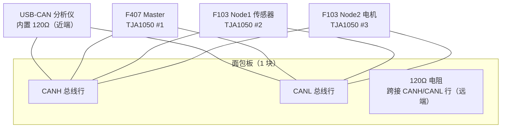

# 三节点 CAN 接线图（1 块面包板方案）

> 适用：F407 Master + F103 Node1（传感器）+ F103 Node2（电机）+ USB-CAN 分析仪，
> 三块 TJA1050 与 120Ω 终端电阻全部集中到同一块 830 孔面包板上。
> 前提：Day15 已验证 F407 单节点收发，本方案把总线扩展为三节点。

## 总体拓扑

说明：CANH/CANL 是"并联"关系，三块 TJA1050 的 CANH 全部落在面包板同一行、CANL 全部落在相邻行，再用杜邦线把分析仪也并到这两行。

## 面包板分配

只用面包板的 4 个区域，其余部分留空：

| 面包板区域 | 用途 | 接谁 |
|---|---|---|
| 上方电源轨（任选一侧 +） | 5V 轨 | 三块 TJA1050 的 VCC |
| 上方电源轨（同侧 -） | GND 轨 | 三块 TJA1050 的 GND、F103 的 GND |
| 中间某一行（如第 20 行） | CANH 总线 | 三块 TJA1050 的 CANH + 分析仪 CANH |
| 相邻一行（如第 21 行） | CANL 总线 | 三块 TJA1050 的 CANL + 分析仪 CANL |
| 第 20/21 行之间 | 120Ω 电阻 | 跨接 CANH/CANL（远端终端） |

## 接线表

### TJA1050 #1（F407 Master）

| TJA1050 引脚 | 接到 |
|---|---|
| VCC | 面包板 5V 轨（或 F407 的 5V 脚） |
| GND | 面包板 GND 轨 |
| TXD | F407 PA12（CAN1_TX） |
| RXD | F407 PA11（CAN1_RX） |
| CANH | 面包板 CANH 行 |
| CANL | 面包板 CANL 行 |

### TJA1050 #2（F103 Node1 传感器）

| TJA1050 引脚 | 接到 |
|---|---|
| VCC | 面包板 5V 轨 |
| GND | 面包板 GND 轨 |
| TXD | F103 PA12（CAN1_TX） |
| RXD | F103 PA11（CAN1_RX） |
| CANH | 面包板 CANH 行 |
| CANL | 面包板 CANL 行 |

### TJA1050 #3（F103 Node2 电机）

| TJA1050 引脚 | 接到 |
|---|---|
| VCC | 面包板 5V 轨 |
| GND | 面包板 GND 轨 |
| TXD | F103 PA12（CAN1_TX） |
| RXD | F103 PA11（CAN1_RX） |
| CANH | 面包板 CANH 行 |
| CANL | 面包板 CANL 行 |

### USB-CAN 分析仪

| 分析仪端 | 接到 |
|---|---|
| CANH | 面包板 CANH 行 |
| CANL | 面包板 CANL 行 |

分析仪内置 120Ω 终端电阻，作为总线近端终端，无需外接。

### F103 调试与供电（每块 F103 各一套）

| 连接 | 引脚 | 说明 |
|---|---|---|
| USB-TTL TX | F103 PA10（USART1_RX） | 交叉接 |
| USB-TTL RX | F103 PA9（USART1_TX） | 交叉接 |
| USB-TTL 5V | F103 5V/VIN 脚 | 给 F103 供电 |
| USB-TTL GND | 面包板 GND 轨 | 共地 |
| ST-Link SWDIO | F103 PA13（DIO） | 共用，一次一块 |
| ST-Link SWCLK | F103 PA14（CLK） | |
| ST-Link GND | 面包板 GND 轨 | 共地 |

## 终端电阻

- 近端（PC 侧）：USB-CAN 分析仪内置 120Ω
- 远端（Node2 侧）：面包板上 1 个 120Ω 电阻跨接 CANH/CANL 行
- 不要再加第三个，否则总线负载过重

## 供电与共地

- 所有 GND 最终汇到面包板 GND 轨（F407、两块 F103、三个 TJA1050、分析仪共地）
- F407：USB 线供电；两块 F103：USB-TTL 5V 供电
- ST-Link 只接 DIO/CLK/GND，**不接它的 3.3V**，避免与 USB-TTL 供电打架
- TJA1050 必须 5V 供电（不是 3.3V）

## 验证步骤

1. 接线完成后用万用表/目测确认：三块 TJA1050 的 VCC 都在 5V 轨、GND 都在 GND 轨
2. 只给 F407 上电，PCAN-View（500kbps）应看到 ID=0x100 心跳帧——验证 Master 链路没被扩展破坏
3. 依次给两块 F103 上电，PCAN-View 应看到两个节点各自的心跳/数据帧
4. PCAN-View 发 ID=0x200，F407 串口应打印 `[CAN_RX] node=512`
5. 拔掉 Node2，F407 串口应报离线（Day18 心跳检测的基础）

## 后续扩展（不占面包板）

- MPU6050（Node1，Day18+）：VCC→3.3V、GND、SCL→PB6、SDA→PB7，杜邦线直连
- L298N + 电机 + 编码器（Node2，Day23+）：L298N 接线端子直连，12V 适配器单独供电
